  

  <h3>💻 4th Semester BS Computer Science Student | 🚀 Web Dev Enthusiast</h3>
  
Exploring technologies, building solutions, and mastering Computer Science concepts with a focus on DSA and Object-Oriented Programming.

 

  

## 🧑‍💻 About Me

- 🎓 Currently studying **BS Computer Science** (4th Semester).
- 💡 Passionate about **DSA** and **OOP** primarily in `C++`, as well as `Python` and `JavaScript`.
- 🌐 Currently diving deep into **Web Development** to build aesthetic yet productive, functional tech.
- 🤔 Focused on writing clean, efficient, and well-structured code.

---

## 🛠️ Languages & Tools

  

---

## 📊 Developer Metrics (Auto-Generated)
*My GitHub statistics and activity tracking rendered beautifully via GitHub Actions.*

  

---

  

